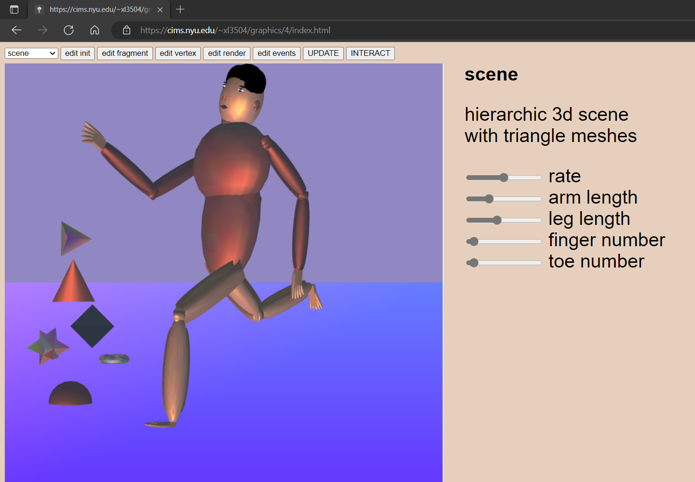
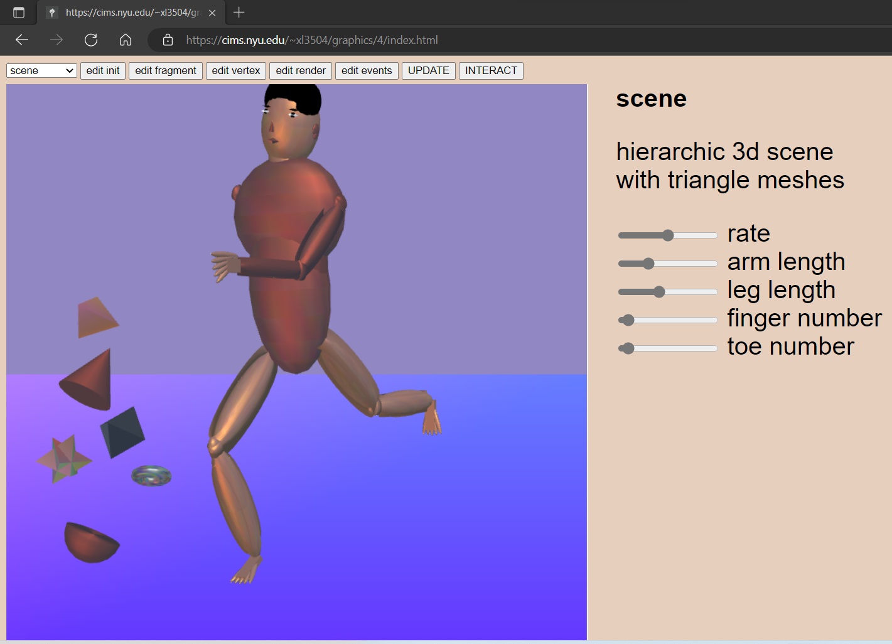
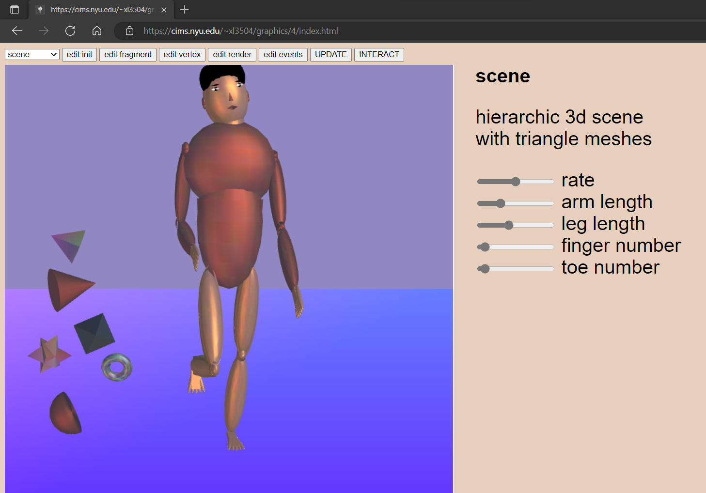
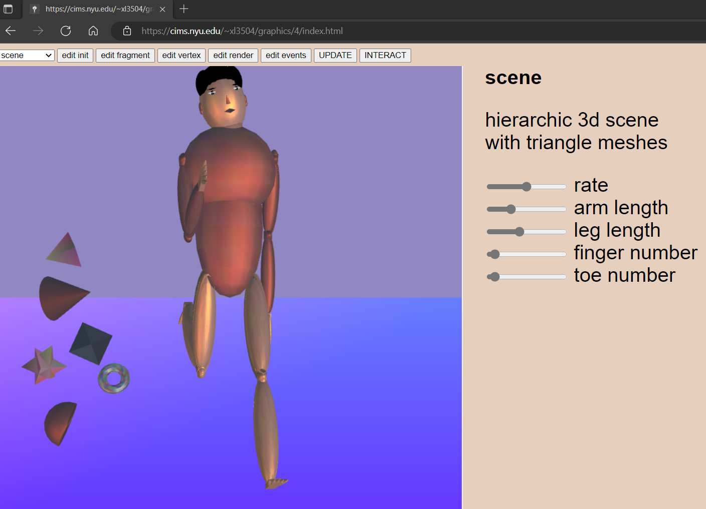
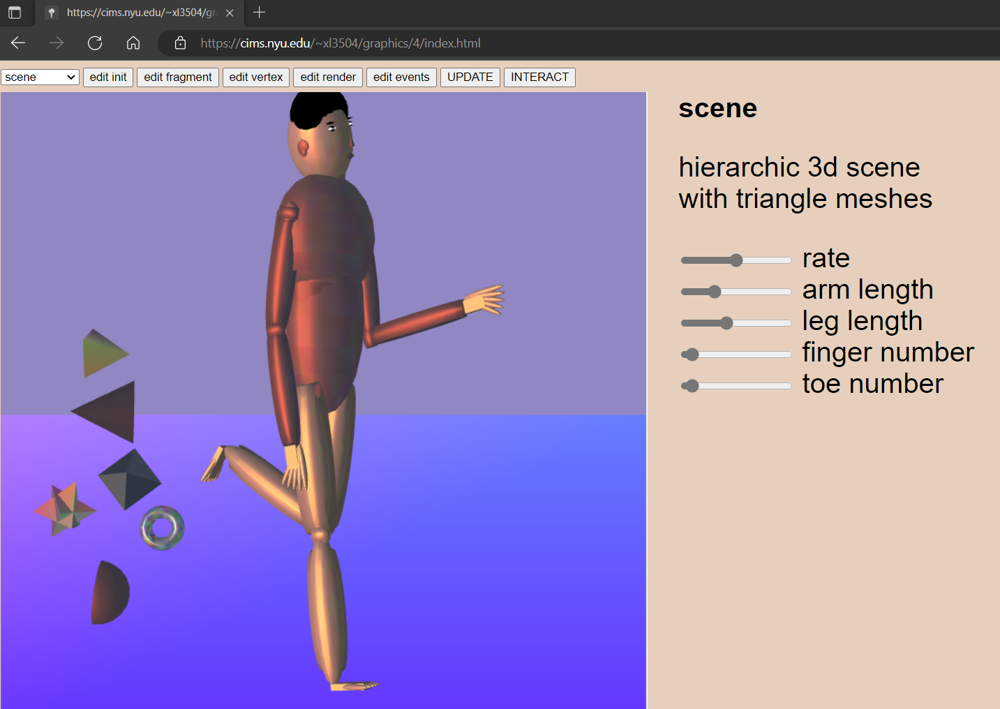

# human body with triangle meshes
Xi Liu 
This project is done for computer graphics course at New York University, fall 2022, using WebGL. 
 
The skeleton of the human body is constructed using a stack of matrices, a stack is used to model the tree structure transformations of each component of the human body with respect to its other components and reflecting a parent to child relationship. Spherical joints are created in between each rotatable component of the body such as shoulder, wrist, elbow, hip knee, and ankle to connect the rigid parts. 
 
The components on the human face such as hair, eyebrows, eyes, ears, nose, mouth are created with mesh geometry including octahedron, spheres, and half spheres using gl.TRIANGLES. Other geometry are also involved in the scene such as dodecahedron, icosahedron, torus, star using either or gl.TRIANGLES and gl.TRIANGLE_STRIP. 
 
You can interact with the simulation by changing the number of fingers, toes, length of limbs, and rate of movement, etc. 
 

